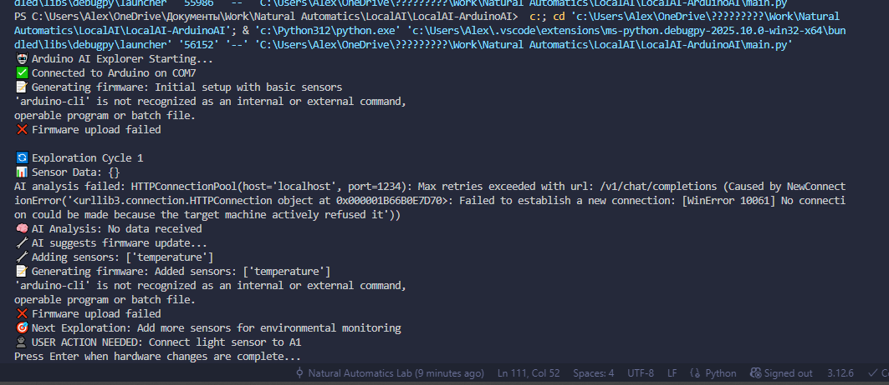
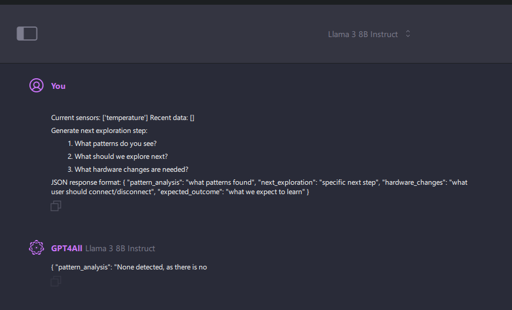

# Arduino AI Explorer

An autonomous AI system that explores the physical world through Arduino sensors, continuously updating firmware and learning from environmental data.

## Quick Start

1. **Install Dependencies**
   ```bash
   pip install -r requirements.txt
   ```

2. **Install Arduino CLI**
   ```bash
   # Download from: https://arduino.github.io/arduino-cli/
   arduino-cli core install arduino:avr
   ```

3. **Connect Arduino**
   - Connect Arduino Uno via USB
   - Start with a temperature sensor on pin A0

4. **Run Explorer**
   ```bash
   python main.py
   ```
5. Open user's UI and see what to connect next to read the data:


## How It Works

1. **Connects** to Arduino via USB auto-detection
2. **Reads** sensor data continuously  
3. **Analyzes** data using local AI model
4. **Generates** new firmware based on insights
5. **Updates** Arduino firmware automatically
6. **Saves** all versions for rollback
7. **Suggests** hardware changes to user
8. **Repeats** cycle for autonomous exploration

## File Structure

- `main.py` - Main exploration loop
- `arduino_interface.py` - USB communication & firmware upload
- `firmware_manager.py` - Version control & sketch generation  
- `ai_core.py` - AI analysis & decision making
- `firmware_versions/` - All firmware versions saved here
- `exploration_log.json` - Session data and insights

## Supported Sensors

- Temperature (analog pin A0)
- Light (analog pin A1) 
- Motion (digital pin 2)
- More sensors added dynamically by AI

## Configuration

**GPT4ALL Setup:**
- Ensure GPT4ALL server is running on `http://localhost:4891`
- Model will be trained with each exploration cycle
- Training data saved to `ArduinoAI_training/` folder

**Variables to edit:**
- `current_sensors` in `main.py` - Starting sensor list
- `base_url` in `ai_core.py` - GPT4ALL server endpoint
- Arduino board type in `arduino_interface.py`

## Testing
After running multiple iterration AI asking user to change physical Arduino connections to evolve


Requests working with local AI model running in GPT4ALL 


Generating new firmware based on the data from the real world sensors:

